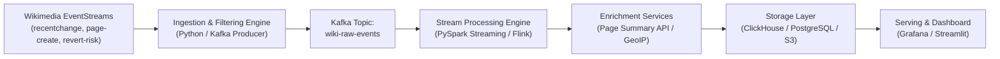

# WikiPulse: Data Sources & Project Architecture Analysis

This document outlines the streaming data sources, dimension enrichment APIs, and sample project architectures for **WikiPulse** (Data Engineering at Scale).

---

## 1. Real-Time Event Streams (SSE / Kafka)

Wikimedia exposes over 30 live Server-Sent Events (SSE) streams at:
`https://stream.wikimedia.org/v2/stream/{stream-name}`

### Key Available Streams

| Stream Name | Data Provided | Value for WikiPulse |
| :--- | :--- | :--- |
| **`recentchange`** | Real-time edits, creations, categorizations, and log actions across all Wikimedia projects. | Core event stream for activity monitoring and throughput benchmarking. |
| **`mediawiki.page_revert_risk_prediction_change.v1`** | **Real-time ML Revert Risk Scores** (probabilities from 0.0 to 1.0 predicting whether an edit is vandalism/will be reverted). | High-value machine learning stream for real-time anomaly and vandalism detection. |
| **`mediawiki.page_outlink_topic_prediction_change.v1`** | **Automated Topic Classification** (e.g., Politics, Science, Sports, Geography). | Automatically aggregate and segment streaming edits by subject area without manual tagging. |
| **`page-create`** | Dedicated stream for newly created pages and articles. | Track creation of new knowledge and emerging topics. |
| **`page-delete`** | Page deletions and reasons (e.g., copyright violation, spam, hoax). | Content moderation analytics, audit logs, and spam patterns. |
| **`mediawiki.revision-tags-change`** | Tags applied to revisions (e.g., `mobile edit`, `visualeditor`, `reverted`). | Analyze device breakdown (mobile vs. desktop) and editor tooling adoption. |

> [!TIP]
> **Composite Streams**: You can subscribe to multiple streams concurrently by comma-separating their names in the URL:  
> `https://stream.wikimedia.org/v2/stream/recentchange,page-create,page-delete`

---

## 2. Dimension & Enrichment APIs (REST / Batch)

You can enrich streaming events in real-time or micro-batches using Wikimedia's public REST APIs:

### A. Page Summary & Coordinates API
- **Endpoint**: `https://en.wikipedia.org/api/rest_v1/page/summary/{title}`
- **Fields Provided**:
  - `coordinates`: Latitude (`lat`) and Longitude (`lon`) for geographical entities (cities, monuments, landmarks).
  - `extract`: First paragraph / summary text of the article.
  - `description`: Short classification (e.g., "Capital of Karnataka, India").
  - `thumbnail`: Direct URL and dimensions for the article's lead image.
  - `wikibase_item`: Wikidata QID (e.g., `Q1355` for Bengaluru).

### B. Pageviews Metrics API
- **Endpoint**: `https://wikimedia.org/api/rest_v1/metrics/pageviews/per-article/en.wikipedia.org/all-access/all-agents/{article}/daily/{start}/{end}`
- **Fields Provided**: Daily or hourly view counts for any article.
- **Use Case**: Correlate **edit bursts** (content supply) with **pageview spikes** (readership demand) to detect viral or breaking events.

### C. IP Geolocation Enrichment
- **Tool**: Offline database via **MaxMind GeoLite2** (`pip install geoip2`) or HTTP lookup (`http://ip-api.com/json/{ip}`).
- **Fields Provided**: Country, City, Region, Latitude, Longitude, ISP/ASN.
- **Use Case**: Geocode anonymous edits (where `user` is an IPv4 or IPv6 address) onto a geographic map.

---

## 3. Project Architecture Ideas for WikiPulse



#### Architecture Diagram (Text / ASCII View)

```text
┌───────────────────────────────────────────────────────────┐
│              Wikimedia EventStreams (SSE / HTTP)           │
│  - recentchange  - page-create  - revert_risk ML scores   │
└─────────────────────────────┬─────────────────────────────┘
                              │
                              ▼
┌───────────────────────────────────────────────────────────┐
│              Ingestion & Filtering Engine                 │
│         (Python script / Kafka Producer)                  │
└─────────────────────────────┬─────────────────────────────┘
                              │
                              ▼
┌───────────────────────────────────────────────────────────┐
│               Apache Kafka Message Broker                 │
│            Topic: 'enwiki-filtered-events'                │
└─────────────────────────────┬─────────────────────────────┘
                              │
                              ▼
┌───────────────────────────────────────────────────────────┐
│               Stream Processing Engine                    │
│             (PySpark Streaming / Apache Flink)            │
│  - 5-minute sliding windows                               │
│  - Anomaly & edit burst detection                         │
│  - Bot vs Human segmentation                              │
└──────────────┬─────────────────────────────▲──────────────┘
               │                             │
               │ (Call REST API)             │ (Enriched metadata)
               ▼                             │
    ┌────────────────────────────────────────┴────┐
    │          Enrichment & Lookup Services       │
    │  - Page Summary API (Extract, Coordinates)  │
    │  - GeoIP Resolver (Country, City for IPs)   │
    │  - Pageviews API (Historical baseline)      │
    └─────────────────────────────────────────────┘
                              │
                              ▼
┌───────────────────────────────────────────────────────────┐
│                   Storage Layer                           │
│  - ClickHouse / PostgreSQL (Aggregated metrics & alerts)  │
│  - S3 / Parquet (Raw historical data lake)                │
└─────────────────────────────┬─────────────────────────────┘
                              │
                              ▼
┌───────────────────────────────────────────────────────────┐
│              Serving & Visualization Layer                │
│         - Streamlit Dashboard / Grafana                   │
│         - Real-time Alerting (Webhooks / Slack)           │
└───────────────────────────────────────────────────────────┘
```

### Idea 1: Breaking News & Viral Spike Detector (Recommended)
- **Concept**: Articles that receive sudden bursts of edits (e.g., >15 edits in 5 minutes by multiple distinct contributors) often correspond to breaking news (e.g., elections, natural disasters, sporting events, celebrity deaths).
- **Pipeline**:
  1. Ingest `recentchange` filtered to `en.wikipedia.org`.
  2. Implement sliding-window aggregation grouped by `title`.
  3. When an edit rate threshold is exceeded, call the **Page Summary API** to fetch the thumbnail, extract, and Wikidata entity.
  4. Emit a high-priority "Breaking News Alert" event to a downstream alert queue or dashboard.

### Idea 2: Real-time Vandalism & Revert Risk Monitor
- **Concept**: Stream Wikimedia's machine learning predictions to identify potentially damaging edits as they happen.
- **Pipeline**:
  1. Stream `recentchange` alongside `mediawiki.page_revert_risk_prediction_change.v1`.
  2. Join streams on `revision.new` / `id`.
  3. Filter for edits with `revert_risk > 0.80`.
  4. Track latency between when high-risk edits occur and when a rollback/revert is executed.

### Idea 3: Global Geospatial Edit Pulse (Live Map)
- **Concept**: A live world map visualizing where Wikipedia knowledge is being created and modified.
- **Pipeline**:
  1. For anonymous edits: resolve the editor's IP address to a geographic point.
  2. For subject pages (places, monuments, buildings): fetch article `coordinates` (`lat`, `lon`) from the Page Summary API.
  3. Contrast *"Where the editor is located"* against *"What location the article is about"*.

### Idea 4: Bot vs. Human Content Churn Analytics
- **Concept**: Analyze net content growth (`length.new - length.old`) by namespace, user classification, and time of day.
- **Key Metrics**:
  - Net bytes added vs. deleted per minute.
  - Automation ratio (Bot vs. Human edit share).
  - Leaderboard of most active contributors and most actively revised namespaces.
